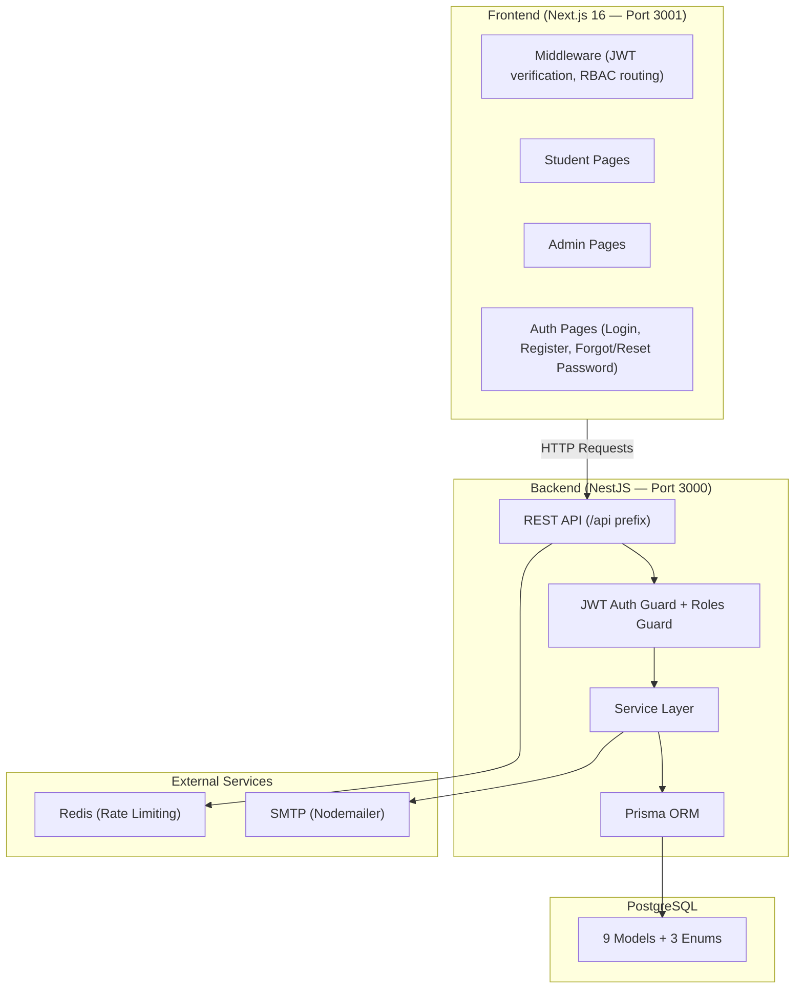
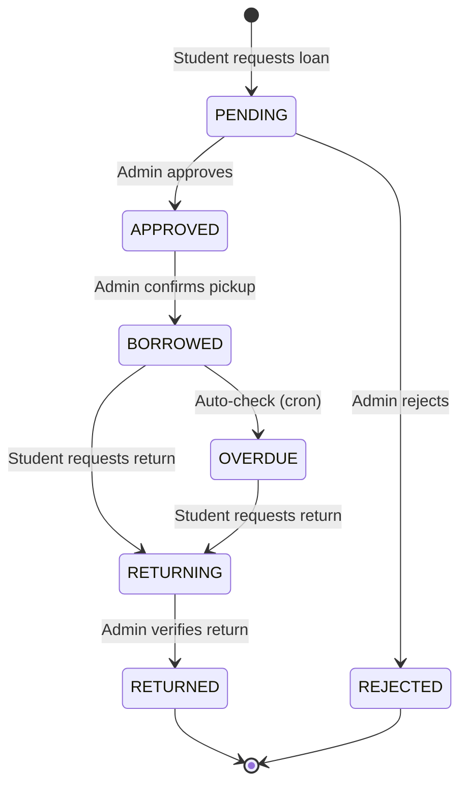

# YOMU — Product Specification

> **YOMU** is a full-stack digital library management system for schools, enabling students to discover, borrow, and review books, while admins manage collections, loans, users, and reports.

---

## 1. Overview

| Attribute        | Detail                                                      |
| ---------------- | ----------------------------------------------------------- |
| **Product Name** | YOMU (読む — "to read" in Japanese)                          |
| **Type**         | Web Application (Responsive)                                |
| **Domain**       | School Library Management                                   |
| **Users**        | Students (Siswa) & Administrators (Admin)                   |
| **Backend**      | NestJS (TypeScript), PostgreSQL, Prisma ORM, JWT Auth       |
| **Frontend**     | Next.js 16 (React 19), Tailwind CSS 4, Framer Motion        |
| **Architecture** | REST API with role-based access control (RBAC)              |

---

## 2. User Roles & Permissions

### 2.1 Student (SISWA)
- Browse & search book catalog
- View book details, reviews, and ratings
- Borrow books (submit loan requests)
- Return books (submit return requests with damage reporting)
- View personal loan history
- Manage favorites/wishlist
- Send/receive messages with admin
- View personal dashboard statistics
- Update profile & change password

### 2.2 Administrator (ADMIN)
- Full book catalog management (CRUD)
- Category, class, and major management (master data)
- User management (create, edit, activate/deactivate, delete)
- Loan workflow management (approve, reject, mark borrowed, verify returns)
- Overdue loan monitoring & automated status updates
- Dashboard with library statistics
- Reports with date filtering, popular books, active members
- CSV export of loan data
- Send/receive messages with students
- Library rules management

---

## 3. System Architecture



---

## 4. Data Models

### 4.1 Entity Relationship

```mermaid
erDiagram
    User ||--o{ Loan : "borrows"
    User ||--o{ Favorite : "favorites"
    User ||--o{ Review : "reviews"
    User ||--o{ Message : "sends/receives"
    User ||--o{ Conversation : "participates"
    User }o--|| Major : "belongs to"
    User }o--|| Class : "belongs to"
    Book ||--o{ Loan : "loaned"
    Book ||--o{ Favorite : "favorited"
    Book ||--o{ Review : "reviewed"
    Book }o--|| Category : "categorized"
    Conversation ||--o{ Message : "contains"
```

### 4.2 Core Models

| Model          | Key Fields                                                                  |
| -------------- | --------------------------------------------------------------------------- |
| **User**       | id, email, password, name, role (SISWA/ADMIN), majorId, classId, isActive, avatarUrl, resetPasswordToken |
| **Book**       | id, title, author, publisher, year, isbn, categoryId, synopsis, coverUrl, stock, availableStock |
| **Category**   | id, name, color, description                                               |
| **Loan**       | id, userId, bookId, loanDate, dueDate, returnDate, status, isDamaged, reportedDamaged, studentNote, fineAmount, adminNotes, verifiedBy |
| **Favorite**   | id, userId, bookId (unique combo)                                           |
| **Message**    | id, senderId, receiverId, content, isRead, isEdited, messageType (TEXT/BOOK_CARD), bookId |
| **Conversation** | id, participant1Id, participant2Id, lastMessageAt                        |
| **Review**     | id, userId, bookId, rating, comment (unique user+book)                      |
| **Major**      | id, name                                                                    |
| **Class**      | id, name                                                                    |

### 4.3 Enums

| Enum            | Values                                                          |
| --------------- | --------------------------------------------------------------- |
| **Role**        | `SISWA`, `ADMIN`                                                |
| **LoanStatus**  | `PENDING`, `APPROVED`, `BORROWED`, `RETURNING`, `RETURNED`, `REJECTED`, `OVERDUE` |
| **MessageType** | `TEXT`, `BOOK_CARD`                                             |

---

## 5. Feature Specifications

### 5.1 Authentication & Authorization

| Feature              | Method | Endpoint                   | Auth | Role |
| -------------------- | ------ | -------------------------- | ---- | ---- |
| Register             | POST   | `/api/auth/register`       | No   | —    |
| Login                | POST   | `/api/auth/login`          | No   | —    |
| Logout               | POST   | `/api/auth/logout`         | Yes  | Any  |
| Get Profile          | GET    | `/api/auth/me`             | Yes  | Any  |
| Update Profile       | PUT    | `/api/auth/profile`        | Yes  | Any  |
| Change Password      | POST   | `/api/auth/change-password`| Yes  | Any  |
| Forgot Password      | POST   | `/api/auth/forgot-password`| No   | —    |
| Reset Password       | POST   | `/api/auth/reset-password` | No   | —    |

**Details:**
- JWT-based stateless authentication (7-day expiry)
- Password hashing with bcrypt
- Frontend middleware validates JWT on Edge Runtime (via `jose`)
- Role-based route protection: `/admin/*` → ADMIN only, `/siswa/*` → SISWA only
- Password reset via email token (Nodemailer SMTP)

---

### 5.2 Book Catalog Management

| Feature              | Method | Endpoint                      | Auth | Role  |
| -------------------- | ------ | ----------------------------- | ---- | ----- |
| List Books           | GET    | `/api/books`                  | No   | —     |
| Get Popular Books    | GET    | `/api/books/popular`          | No   | —     |
| Get Recommendations  | GET    | `/api/books/recommendations`  | Yes  | Any   |
| Get Book Detail      | GET    | `/api/books/:id`              | No   | —     |
| Create Book          | POST   | `/api/books`                  | Yes  | Admin |
| Update Book          | PUT    | `/api/books/:id`              | Yes  | Admin |
| Delete Book          | DELETE | `/api/books/:id`              | Yes  | Admin |

**Details:**
- Paginated listing with search (title) and category filter
- Popularity ranking based on loan count
- Personalized recommendations for authenticated students
- Soft delete support (`deletedAt`)
- Stock tracking with `stock` and `availableStock` fields

---

### 5.3 Loan Management (Core Workflow)



| Feature                  | Method | Endpoint                         | Auth | Role    |
| ------------------------ | ------ | -------------------------------- | ---- | ------- |
| List All Loans           | GET    | `/api/loans`                     | Yes  | Admin   |
| Pending Verification     | GET    | `/api/loans/pending-verification`| Yes  | Admin   |
| Overdue Loans            | GET    | `/api/loans/overdue`             | Yes  | Admin   |
| Trigger Overdue Check    | POST   | `/api/loans/check-overdue`       | Yes  | Admin   |
| My Loans                 | GET    | `/api/loans/my`                  | Yes  | Student |
| Create Loan Request      | POST   | `/api/loans`                     | Yes  | Student |
| Request Return           | PUT    | `/api/loans/:id/return`          | Yes  | Student |
| Approve Loan             | PUT    | `/api/loans/:id/approve`         | Yes  | Admin   |
| Reject Loan              | PUT    | `/api/loans/:id/reject`          | Yes  | Admin   |
| Mark as Borrowed         | PUT    | `/api/loans/:id/borrowed`        | Yes  | Admin   |
| Verify Return            | PUT    | `/api/loans/:id/verify-return`   | Yes  | Admin   |
| Get Loan Detail          | GET    | `/api/loans/:id`                 | Yes  | Any     |

**Details:**
- Multi-step loan lifecycle with 7 statuses
- Damage reporting with `reportedDamaged`, `isDamaged`, and `studentNote`
- Fine tracking via `fineAmount`
- Admin notes per loan action
- Automated overdue detection (schedulable via cron)
- Email notifications on loan status changes

---

### 5.4 User Management (Admin)

| Feature              | Method | Endpoint                   | Auth | Role  |
| -------------------- | ------ | -------------------------- | ---- | ----- |
| Create User          | POST   | `/api/users`               | Yes  | Admin |
| List Users           | GET    | `/api/users`               | Yes  | Admin |
| Get User             | GET    | `/api/users/:id`           | Yes  | Admin |
| Update User          | PUT    | `/api/users/:id`           | Yes  | Admin |
| Toggle Status        | PUT    | `/api/users/:id/status`    | Yes  | Admin |
| Delete User          | DELETE | `/api/users/:id`           | Yes  | Admin |

**Details:**
- Paginated user listing with search/filter
- Activate/deactivate users without deletion
- Soft delete support

---

### 5.5 Master Data Management

#### Categories

| Feature     | Method | Endpoint                | Auth | Role  |
| ----------- | ------ | ----------------------- | ---- | ----- |
| List All    | GET    | `/api/categories`       | No   | —     |
| Get One     | GET    | `/api/categories/:id`   | No   | —     |
| Create      | POST   | `/api/categories`       | Yes  | Admin |
| Update      | PUT    | `/api/categories/:id`   | Yes  | Admin |
| Delete      | DELETE | `/api/categories/:id`   | Yes  | Admin |

#### Classes

| Feature     | Method | Endpoint             | Auth | Role  |
| ----------- | ------ | -------------------- | ---- | ----- |
| List All    | GET    | `/api/classes`       | No   | —     |
| Create      | POST   | `/api/classes`       | Yes  | Admin |
| Delete      | DELETE | `/api/classes/:id`   | Yes  | Admin |

#### Majors

| Feature     | Method | Endpoint            | Auth | Role  |
| ----------- | ------ | ------------------- | ---- | ----- |
| List All    | GET    | `/api/majors`       | No   | —     |
| Create      | POST   | `/api/majors`       | Yes  | Admin |
| Delete      | DELETE | `/api/majors/:id`   | Yes  | Admin |

---

### 5.6 Favorites / Wishlist

| Feature         | Method | Endpoint                       | Auth | Role    |
| --------------- | ------ | ------------------------------ | ---- | ------- |
| My Favorites    | GET    | `/api/favorites`               | Yes  | Student |
| Add Favorite    | POST   | `/api/favorites/:bookId`       | Yes  | Student |
| Remove Favorite | DELETE | `/api/favorites/:bookId`       | Yes  | Student |
| Check Favorite  | GET    | `/api/favorites/:bookId/check` | Yes  | Student |

---

### 5.7 Messaging System

| Feature                | Method | Endpoint                              | Auth | Role |
| ---------------------- | ------ | ------------------------------------- | ---- | ---- |
| Get Conversations      | GET    | `/api/conversations`                  | Yes  | Any  |
| Get Messages           | GET    | `/api/conversations/:id/messages`     | Yes  | Any  |
| Send Message           | POST   | `/api/messages`                       | Yes  | Any  |
| Mark All Read          | PUT    | `/api/messages/read-all`              | Yes  | Any  |
| Mark Message Read      | PUT    | `/api/messages/:id/read`              | Yes  | Any  |
| Edit Message           | PUT    | `/api/messages/:id`                   | Yes  | Any  |
| Delete Message         | DELETE | `/api/messages/:id`                   | Yes  | Any  |
| Unread Count           | GET    | `/api/messages/unread-count`          | Yes  | Any  |

**Details:**
- WhatsApp-style chat interface
- Support for `TEXT` and `BOOK_CARD` message types
- Edit & delete messages
- Read receipts and unread count
- Automatic conversation creation

---

### 5.8 Reviews & Ratings

| Feature           | Method | Endpoint                     | Auth | Role    |
| ----------------- | ------ | ---------------------------- | ---- | ------- |
| Create Review     | POST   | `/api/reviews`               | Yes  | Student |
| Get Book Reviews  | GET    | `/api/reviews/book/:bookId`  | No   | —       |

**Details:**
- One review per user per book (unique constraint)
- Star rating (1–5) with text comment

---

### 5.9 Reports & Analytics (Admin)

| Feature            | Method | Endpoint                     | Auth | Role  |
| ------------------ | ------ | ---------------------------- | ---- | ----- |
| Summary Stats      | GET    | `/api/reports/summary`       | Yes  | Admin |
| Loan Reports       | GET    | `/api/reports/loans`         | Yes  | Admin |
| Popular Books      | GET    | `/api/reports/popular-books` | Yes  | Admin |
| Active Members     | GET    | `/api/reports/active-members`| Yes  | Admin |
| Export CSV          | GET    | `/api/reports/export`        | Yes  | Admin |

---

### 5.10 Dashboard Statistics

| Feature           | Method | Endpoint              | Auth | Role    |
| ----------------- | ------ | --------------------- | ---- | ------- |
| Student Stats     | GET    | `/api/stats/siswa`    | Yes  | Student |
| Admin Stats       | GET    | `/api/stats/admin`    | Yes  | Admin   |

---

## 6. Frontend Pages

### 6.1 Public Pages

| Page              | Route                | Description                          |
| ----------------- | -------------------- | ------------------------------------ |
| Landing           | `/`                  | Redirect to login                    |
| Login             | `/login`             | Email + password login               |
| Register          | `/register`          | Student registration with major/class|
| Forgot Password   | `/forgot-password`   | Request password reset email         |
| Reset Password    | `/reset-password`    | Set new password via token           |

### 6.2 Student Pages (SISWA)

| Page              | Route                   | Description                                         |
| ----------------- | ----------------------- | --------------------------------------------------- |
| Dashboard         | `/siswa`                | Personal stats, active loans, popular books          |
| Book Catalog      | `/siswa/katalog`        | Browse/search books with category filter             |
| Book Detail       | `/siswa/detail/:id`     | Book info, borrow button, reviews, similar books     |
| My Loans          | `/siswa/peminjaman`     | Loan history with status tracking, return action     |
| Favorites         | `/siswa/favorit`        | Saved/wishlisted books                               |
| Messages          | `/siswa/pesan`          | Chat with admin (WhatsApp-style)                     |
| Rules             | `/siswa/peraturan`      | Library rules & policies                             |

### 6.3 Admin Pages

| Page              | Route                   | Description                                         |
| ----------------- | ----------------------- | --------------------------------------------------- |
| Dashboard         | `/admin`                | Library stats, recent activity, charts               |
| Book Management   | `/admin/buku`           | CRUD books with search/filter                        |
| Member Management | `/admin/anggota`        | CRUD users, activate/deactivate                      |
| Loan Management   | `/admin/peminjaman`     | Approve/reject/verify loan workflow                  |
| Category Mgmt     | `/admin/kategori`       | CRUD categories (+ Classes & Majors via modal)       |
| Reports           | `/admin/laporan`        | Reports with date range, export CSV                  |
| Messages          | `/admin/pesan`          | Chat with students (WhatsApp-style)                  |
| Rules             | `/admin/peraturan`      | Manage library rules                                 |

### 6.4 Shared Components

| Component            | Description                                              |
| -------------------- | -------------------------------------------------------- |
| `Header.tsx`         | Student header with search, notifications, profile       |
| `AdminHeader.tsx`    | Admin header with search, notifications, profile         |
| `Sidebar.tsx`        | Student navigation sidebar                               |
| `AdminSidebar.tsx`   | Admin navigation sidebar                                 |
| `BookCard.tsx`       | Reusable book card with cover, title, rating             |
| `ConfirmModal.tsx`   | Generic confirmation dialog                              |
| `MasterDataModal.tsx`| Modal for managing classes & majors                      |
| `ProfileModal.tsx`   | Profile edit modal with avatar, info, password change    |
| `AppTour.tsx`        | Interactive onboarding tour for new users                |
| `SiswaSkeleton.tsx`  | Loading skeleton for student pages                       |
| `AdminSkeleton.tsx`  | Loading skeleton for admin pages                         |

---

## 7. Security

| Mechanism                      | Implementation                                   |
| ------------------------------ | ------------------------------------------------ |
| **Authentication**             | JWT (7-day expiry, stored in cookie)             |
| **Password Storage**           | bcrypt hashing                                   |
| **Route Protection (API)**     | `JwtAuthGuard` + `RolesGuard` (NestJS)           |
| **Route Protection (Frontend)**| Next.js Edge Middleware with `jose` JWT verify   |
| **Input Validation**           | `class-validator` with `whitelist: true`, `forbidNonWhitelisted: true` |
| **CORS**                       | Strict origin allowlist                          |
| **Rate Limiting**              | `@nestjs/throttler` with Redis storage           |
| **Payload Limit**              | 50MB max (for book covers)                       |
| **Compression**                | gzip via `compression` middleware                |

---

## 8. Tech Stack Summary

### Backend
| Technology          | Purpose                        |
| ------------------- | ------------------------------ |
| NestJS 11           | API framework                  |
| TypeScript 5        | Language                       |
| PostgreSQL          | Primary database               |
| Prisma 5            | ORM & migrations               |
| Passport + JWT      | Authentication                 |
| bcrypt              | Password hashing               |
| Nodemailer          | Email service (SMTP)           |
| ioredis             | Redis client (rate limiting)   |
| class-validator     | DTO validation                 |
| compression         | Response compression           |
| @nestjs/schedule    | Cron jobs (overdue checks)     |

### Frontend
| Technology          | Purpose                        |
| ------------------- | ------------------------------ |
| Next.js 16          | React framework (App Router)   |
| React 19            | UI library                     |
| Tailwind CSS 4      | Styling                        |
| Framer Motion       | Animations                     |
| jose                | JWT verification (Edge)        |
| react-hot-toast     | Toast notifications            |
| sonner              | Toast notifications (alt)      |

---

## 9. API Response Format

All API endpoints follow a standardized response format:

```json
{
  "success": true,
  "message": "Operation description",
  "data": { },
  "meta": {
    "page": 1,
    "limit": 20,
    "total": 100,
    "totalPages": 5
  }
}
```

Error responses:

```json
{
  "success": false,
  "message": "Error description",
  "statusCode": 400
}
```

---

## 10. Database Indexes

| Table    | Index Fields              | Purpose                    |
| -------- | ------------------------- | -------------------------- |
| books    | `title`                   | Full-text search           |
| books    | `category_id`             | Category filter            |
| loans    | `user_id`                 | User's loan history        |
| loans    | `book_id`                 | Book's loan history        |
| loans    | `status`                  | Status-based queries       |
| messages | `sender_id`               | Sent messages lookup       |
| messages | `receiver_id`             | Received messages lookup   |

---

## 11. Environment Configuration

### Backend (`.env`)
| Variable            | Description                          | Default               |
| ------------------- | ------------------------------------ | --------------------- |
| `PORT`              | API server port                      | `3000`                |
| `DATABASE_URL`      | PostgreSQL connection string         | —                     |
| `JWT_SECRET`        | JWT signing secret                   | —                     |
| `JWT_EXPIRES_IN`    | Token expiration                     | `7d`                  |
| `FRONTEND_URL`      | Allowed CORS origin                  | `http://localhost:3001` |

### Frontend (`.env.local`)
| Variable               | Description              | Default                    |
| ---------------------- | ------------------------ | -------------------------- |
| `NEXT_PUBLIC_API_URL`  | Backend API base URL     | `http://localhost:3000/api` |
| `JWT_SECRET`           | JWT secret (middleware)  | —                          |
